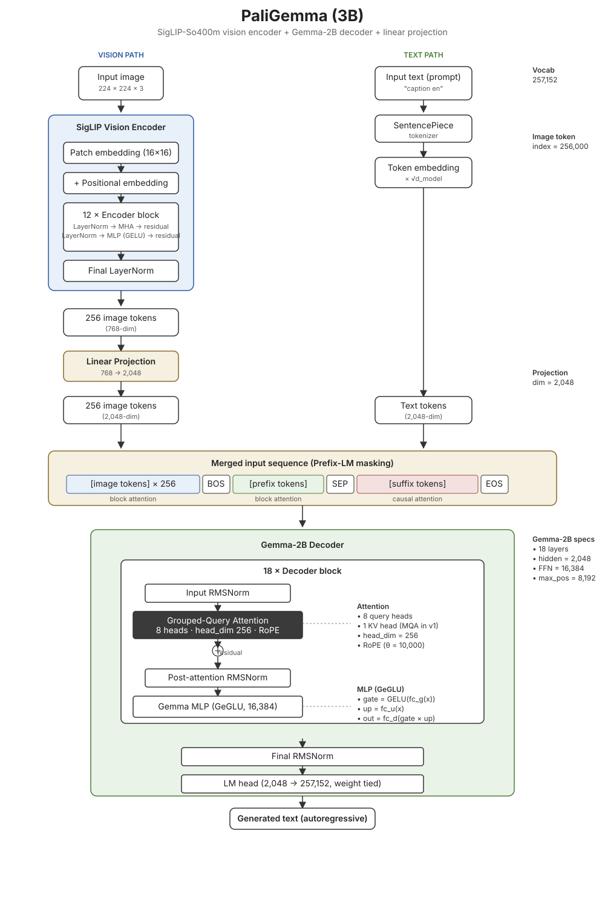

# PaliGemma (3B)

Google DeepMind's May 2024 open vision-language model — the first VLM in the Gemma family. Combines a **SigLIP-So400m** vision encoder, a **linear projection**, and the **Gemma-2B** language decoder into a single 3B-parameter model. Unlike a chat VLM, PaliGemma is designed as a *transfer base*: pretrained on multimodal data, then fine-tuned for downstream tasks (captioning, VQA, OCR, segmentation, etc.).

The architectural point of interest here isn't a new attention variant — it's the **prefix-LM masking** that lets the model attend bidirectionally over the image tokens and prompt while decoding the response autoregressively.

*Diagram drawn for this repo (no official Raschka gallery entry). References below.*

## Key specs

- **Parameters:** ~3B total (SigLIP-So400m ≈ 400M + Gemma-2B ≈ 2B + linear projection)
- **Vision encoder:** SigLIP-So400m ViT — 12 layers, 768 hidden, 12 heads, patch size 16, image size 224
- **Language decoder:** Gemma-2B — 18 layers, 2,048 hidden, 8 query heads with MQA (1 KV head), head_dim 256, FFN 16,384, max positions 8,192
- **Projection:** single linear layer, 768 → 2,048
- **Vocab size:** 257,152 (Gemma tokens + 1,024 image tokens + special)
- **Image token index:** 256,000
- **Context length:** 8,192
- **Positional encoding (decoder):** RoPE (θ = 10,000)
- **Normalization:** RMSNorm in the decoder, LayerNorm in the SigLIP encoder
- **Activation:** GeGLU in the decoder, GELU (tanh approx.) in the encoder

## What makes PaliGemma different

- **Two-tower + linear-projection fusion.** No cross-attention, no Q-Former, no perceiver resampler — just concatenate image tokens (after a single linear projection) with text tokens and feed everything into the language decoder. The PaliGemma paper explicitly notes that fancier projectors (MLPs, Q-Former-style) did not help.
- **Prefix-LM masking.** The input sequence is `[image tokens..., BOS, prefix tokens..., SEP, suffix tokens..., EOS, PAD...]`. The image and prefix tokens are attended to **bidirectionally** (block attention), while the suffix uses standard **causal** attention. This is a key departure from a pure decoder-only architecture: it lets the model reason over the image + prompt with full context before decoding the response.
- **Small, fixed number of image tokens.** SigLIP produces exactly 256 image tokens at 224px² resolution (or 1,024 at 448px², or 4,096 at 896px²). This is far fewer than dense token schemes and keeps the effective decoder context short.
- **Transfer base, not chat.** The 3-stage training recipe (unimodal → multimodal @ 224px → multimodal @ 448px) is designed to make the model easy to fine-tune, not to serve dialogue directly.

## Repo layout

This model spans four files rather than the usual single `model.py`:

- **`siglip.py`** — the SigLIP vision encoder (patch embedding, position embedding, 12 encoder blocks with pre-LayerNorm attention + MLP, final LayerNorm).
- **`decoder.py`** — the Gemma-2B decoder: `GemmaRMSNorm`, `GemmaRoPE`, `GemmaAttention` (GQA + RoPE), `GemmaMLP` (GeGLU), `GemmaDecoder` (pre-norm block with input norm and post-attention norm), `GemmaModel`, `GemmaForCausalLM`.
- **`model.py`** — the top-level `PaliGemmaForConditionalGeneration` that ties everything together: runs SigLIP on the image, projects the vision features via `PaliGemmaMultiModalProjector`, merges them with text embeddings at the `image_token_index` positions, and passes the merged sequence to Gemma.
- **`utils.py`** — `KVCache` (per-layer key/value cache with a `num_items()` helper) and `repeat_kv` (KV-head expansion for GQA).
- **`config.py`** — separate config dicts for `siglip`, `gemma`, and the top-level `pali` model.

## References

- [PaliGemma: A versatile 3B VLM for transfer (paper)](https://arxiv.org/pdf/2407.07726)
- [google/paligemma-3b-pt-224 config.json](https://huggingface.co/google/paligemma-3b-pt-224/blob/main/config.json)
- [google-research/big_vision — official PaliGemma implementation and training recipe](https://github.com/google-research/big_vision/blob/main/big_vision/configs/proj/paligemma/README.md)
- [hkproj/pytorch-paligemma — Umar Jamil's from-scratch PyTorch implementation](https://github.com/hkproj/pytorch-paligemma) *(the primary reference this implementation follows)*
- [Umar Jamil's YouTube channel — deep-dive videos on Transformer internals](https://www.youtube.com/@umarjamilai/videos)
- [SigLIP: Sigmoid Loss for Language Image Pre-Training](https://arxiv.org/pdf/2303.15343)